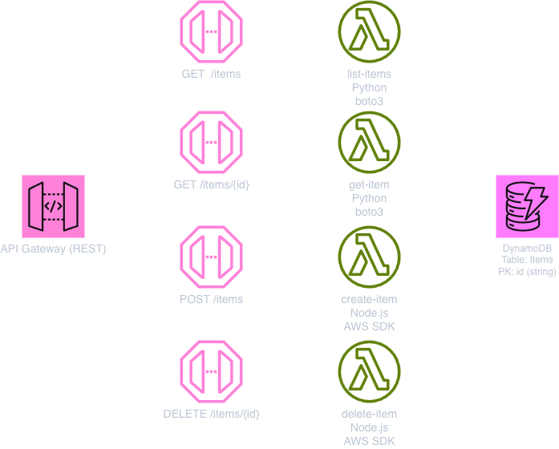

# AWS LocalStack Demo

A demo project showcasing [LocalStack](https://www.localstack.cloud/) for local AWS development. It provisions a simple CRUD API backed by DynamoDB and Lambda functions, first using shell scripts, then using production-grade IaC tools (CDK or Terraform), and finally deploying to real AWS.

## Architecture



## Prerequisites

- [Docker](https://www.docker.com/) or [Podman](https://podman.io/)
- [LocalStack CLI](https://docs.localstack.cloud/getting-started/installation/) (`awslocal`)
- [Node.js](https://nodejs.org/) (for CDK / Lambda write functions)
- [Bruno](https://www.usebruno.com/) (optional, for API testing)

For IaC deployment:
- **CDK path:** AWS CDK + [`cdklocal`](https://github.com/localstack/aws-cdk-local)
- **Terraform path:** Terraform + [`tflocal`](https://github.com/localstack/terraform-local)

## Quick Start

### 1. Start LocalStack

```bash
docker compose up -d
```

### 2. Provision resources

There are three ways to create the infrastructure. Pick one:

#### Option A: Init hooks (shell scripts + `awslocal`)

Uncomment the `init-hooks` volume in `docker-compose.yml`:

```yaml
volumes:
  - "/var/run/docker.sock:/var/run/docker.sock"
  - "./lambdas:/opt/lambdas"
  - "./init-hooks:/etc/localstack/init"   # ← ensure this line is uncommented
```

Restart the container. The scripts in `init-hooks/ready.d/` run in order on startup:

| Script | What it does |
|---|---|
| `01-dynamodb.sh` | Creates the `Items` table |
| `02-lambda.sh` | Deploys four Lambda functions |
| `03-apigateway.sh` | Sets up REST API with routes |
| `04-seed-data.sh` | Seeds two demo items |

> **Tip:** Comment the volume out again before using CDK or Terraform so resources aren't created twice.

#### Option B: CDK (`cdklocal`)

```bash
cd infra/cdk
npm install
npm run local:bootstrap
npm run local:deploy
```

#### Option C: Terraform (`tflocal`)

```bash
cd infra/terraform
tflocal init
tflocal apply
```

### 3. Test the API

Use the included [Bruno](https://www.usebruno.com/) collection in `bruno/` and select the **local** environment.

Or call it directly (replace `<api-id>` with the API Gateway ID from the deployment output):

```bash
# List items
curl https://<api-id>.execute-api.localhost.localstack.cloud:4566/prod/items

# Create item
curl -X POST https://<api-id>.execute-api.localhost.localstack.cloud:4566/prod/items \
  -H "Content-Type: application/json" \
  -d '{"name": "Widget", "description": "A demo widget"}'

# Get item
curl https://<api-id>.execute-api.localhost.localstack.cloud:4566/prod/items/<item-id>

# Delete item
curl -X DELETE https://<api-id>.execute-api.localhost.localstack.cloud:4566/prod/items/<item-id>
```

## Deploying to AWS

The same CDK and Terraform configs deploy to real AWS. Just use the standard CLI tools instead of the LocalStack wrappers:

**CDK:**
```bash
cd infra/cdk
npm run aws:bootstrap
npm run aws:deploy
```

**Terraform:**
```bash
cd infra/terraform
terraform init
terraform apply
```

## Project Structure

```
├── docker-compose.yml          # LocalStack container
├── init-hooks/                 # Shell-based provisioning (awslocal)
│   ├── common/env.sh           #   Shared variables
│   └── ready.d/                #   Startup scripts (run in order)
├── infra/
│   ├── cdk/                    # AWS CDK (TypeScript)
│   └── terraform/              # Terraform
├── lambdas/
│   ├── read-items/             # Python (list & get)
│   └── write-items/            # Node.js (create & delete)
└── bruno/                      # API testing collection
```
